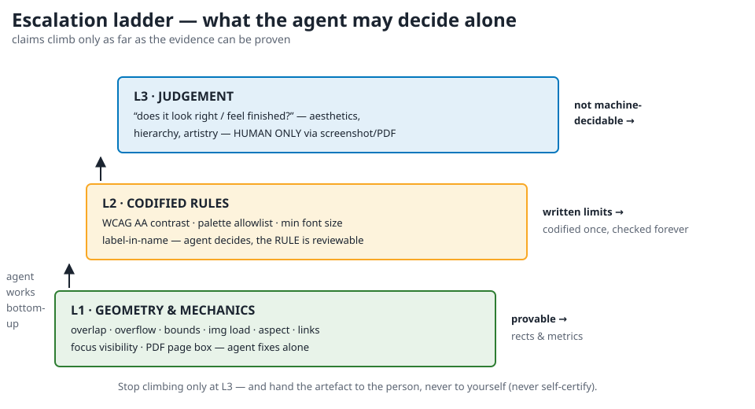
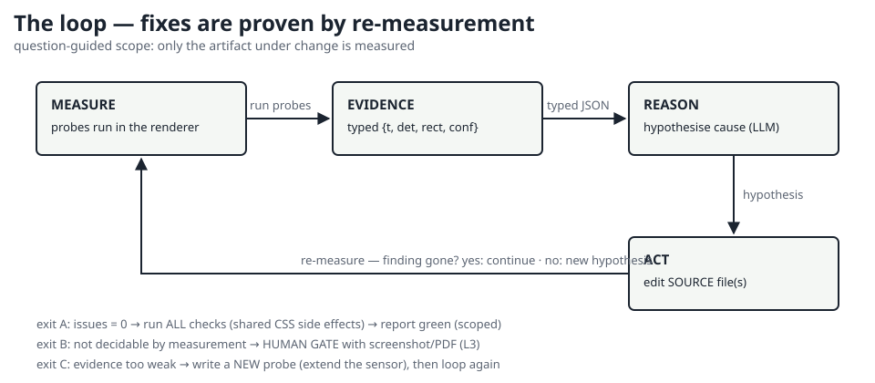

# ligeopersys

**Lightweight Geometric Perception System** — a way for a **text-only AI** to
reason correctly about **rendered visual output** (HTML pages, SVG artwork,
print/PDF) *without seeing a single pixel*.

It does not make a model "see". It turns the **browser renderer into a
sensor**: geometry, load states, contrast ratios and PDF page boxes are
measured as ground truth, shipped as typed JSON evidence, and reasoned over
by any LLM — with an explicit **human gate** for everything that cannot be
measured (taste, hierarchy, "does it look finished").


```text
 artifact ──render──► headless browser ──probes──► EVIDENCE {t, det, rect, conf}
     ▲                                                        │
     └────────────── edit SOURCE ◄── reasoner (text LLM) ◄────┘
                     loop until issues = 0  │  not decidable?
                                            ▼
                                   HUMAN GATE (L3)  ◄── screenshots / PDFs
```

## What it is / isn't

| is | is not |
|---|---|
| renderer-as-sensor: probes report their own geometry | a vision model or an OCR system |
| typed evidence contract with confidence bands | prose descriptions of "what the page looks like" |
| an agentic fix loop: measure → hypothesise → edit → re-measure | "trust me, it looks fixed" |
| an escalation ladder L1 (geometry) → L2 (rules) → L3 (**human**) | an auto-judge of aesthetics |
| self-tested: seeded-bug fixture must be caught, clean fixture must pass | a green light you have to take on faith |

## Quickstart

```bash
pip install websocket-client          # only dependency
npm install axe-core                 # optional, for the WCAG check

python tests/test_selfcheck.py       # trust gate: probes catch planted bugs
python tools/layout_check.py path/to/pages/ --json out/evidence.json
python tools/a11y_check.py path/to/pages/ --keyboard      # needs axe-core
python tools/print_check.py --config examples/print-expectations.json
```

Exit codes are meaningful (`0` = clean); browsers auto-detected (Edge/Chrome,
override with `LIGEO_BROWSER`).

## Evidence in one look

```json
{"t": "OVERFLOW",
 "det": "content clipped: scrollH=3106 > clientH=2646",
 "rect": {"x": 0, "y": 0, "w": 2079, "h": 2646},
 "conf": 0.95}
```

Typed code → pattern-match, one-sentence detail **with the numbers** →
hypothesis, rect → where, conf → whether you may act. Full contract:
[docs/EVIDENCE-SCHEMA.md](docs/EVIDENCE-SCHEMA.md) ·
[docs/evidence.schema.json](docs/evidence.schema.json).

## The gate



- **L1 geometry** — measured; the agent fixes alone.
- **L2 rules** — codified (AA contrast, palette, min font, label-in-name);
  the agent applies them; the *rule* is reviewable.
- **L3 judgement** — "does it look right?" → **human only**, served
  screenshots/print PDFs. The agent never self-certifies.

## The loop



Fixes are **proven by re-measurement**. If evidence is too weak to decide,
you don't guess — you extend the sensor (write a new probe). Rules for the
reasoner: [docs/PLAYBOOK.md](docs/PLAYBOOK.md).

## Repository layout

| path | contents |
|---|---|
| `tools/cdp_runner.py` | L0 transport: browser lifecycle, `run_probe` (always calls the probe), screenshot, printToPDF |
| `tools/layout_check.py` · `a11y_check.py` · `print_check.py` | drivers: geometry, WCAG+focus, print assertions |
| `probes/layout_probe.js` · `svg_probe.js` | L1 sensors (arrow functions, typed findings) |
| `docs/ARCHITECTURE.md` | full-stack architecture, ADRs, failure model |
| `docs/FLOWCHARTS.md` | all ASCII flowcharts (session loop, triage, conflict rules…) |
| `docs/EVIDENCE-SCHEMA.md` · `evidence.schema.json` | the data contract + code registry |
| `docs/PLAYBOOK.md` | rules the reasoner must follow (the deeper methodology) |
| `docs/INTEGRATION.md` | adopting it in another project, CI, custom probes |
| `tests/` | seeded-violation + false-positive self-test (L4 trust gate) |
| `examples/` | real evidence + reasoning cycles from the founding case study |

## Verified

Built and battle-tested while producing a 19-page documentation site, 4
giant-format (55×70 cm) posters, 10 SVG figures and a slide deck **with no
vision capability on the machine**:

| check | result |
|---|---|
| `tests/test_selfcheck.py` | PASS — catches all 7 planted codes, 0 false positives (found 2 real bugs while being written) |
| geometry + style audit | 0 issues over posters, docs, 10 SVGs |
| axe-core WCAG A/AA + keyboard probe | 0 findings on 19 pages |
| `print_check` | A4 docs, 5-slide deck, 4 posters = 1 page each at exactly 55×70 cm |

## Documentation

[Architecture](docs/ARCHITECTURE.md) ·
[Flowcharts](docs/FLOWCHARTS.md) ·
[Evidence schema](docs/EVIDENCE-SCHEMA.md) ·
[Playbook](docs/PLAYBOOK.md) ·
[Integration](docs/INTEGRATION.md)

Origin: specialised from `VISION_BRIDGE_ARCHITECTURE.md` (the general
image→evidence bridge) during a real project where the agent had **no image
vision** — every "visual" judgement had to be earned from measurement or
handed to a human.

## License

[MIT](LICENSE)
