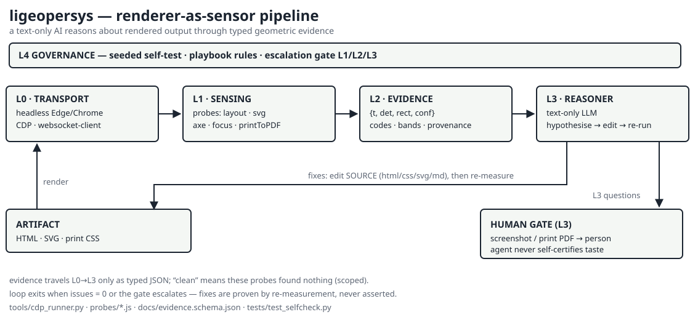

# Architecture

**ligeopersys** — *Lightweight Geometric Perception System* — gives a
**text-only AI** a trustworthy way to reason about **rendered visual output**
(HTML pages, SVG artwork, print/PDF) without ever seeing a pixel.

## The design thesis: renderer-as-sensor

A browser renderer is already a **deterministic, queryable perception
engine**. It knows every rectangle, every transform, every loaded image, every
colour — ground truth, not a neural guess. The system therefore does **not**
try to make a language model "look" at pixels. It makes the renderer *narrate
its own geometry* over the DevTools Protocol, converts that narration into a
typed **evidence contract**, and lets the reasoning model do what it is good
at: forming hypotheses from structured facts, editing the source, and knowing
when to stop and ask a human.

```text
+====================================================================+
|  L4  GOVERNANCE        rules · self-tests · escalation gate L1/L2/L3|
+--------------------------------------------------------------------+
|  L3  REASONER          text-only LLM: hypothesise → edit → re-run  |
|                        knows the boundary: no evidence, no claim   |
+--------------------------------------------------------------------+
|  L2  EVIDENCE          typed JSON findings: {t, det, rect, conf}   |
|                        codes · confidence bands · provenance      |
+--------------------------------------------------------------------+
|  L1  SENSING           probes (JS) injected into the live page:    |
|                        layout_probe · svg_probe · axe-core ·       |
|                        focus walk · printToPDF metrics             |
+--------------------------------------------------------------------+
|  L0  TRANSPORT         headless Edge/Chrome over CDP               |
|                        (cdp_runner.py: attach, evaluate, goto,     |
|                         screenshot, printToPDF)                    |
+====================================================================+
         ^                                    |
         |  fixes (HTML/CSS/SVG/md edits)     |  structured findings
         +------------------------------------+
```

*Detailed flowcharts (ASCII) live in [FLOWCHARTS.md](FLOWCHARTS.md).*



## Layers in detail

| Layer | Name | Component | Runs where | Failure mode |
|---|---|---|---|---|
| L0 | Transport | `tools/cdp_runner.py` | Python ⇄ WebSocket | attach timeout → retry, `LIGEO_BROWSER` override |
| L1 | Sensing | `probes/*.js`, axe-core, `printToPDF` | inside the renderer | probe throw → `E0x` finding, never silence |
| L2 | Evidence | `docs/evidence.schema.json` | JSON in Python | schema-invalid → reasoner treats as missing |
| L3 | Reasoner | the AI agent (you) | LLM context | uncertain → deepen evidence, **never invent** |
| L4 | Governance | `tests/test_selfcheck.py` + PLAYBOOK rules | CI / pre-commit | a probe that stops catching seeds fails the build |

## Component inventory

```text
ligeopersys/
├── tools/          L0+L1 drivers (Python, stdlib + websocket-client)
│   ├── cdp_runner.py      the only module that talks to the browser
│   ├── layout_check.py    geometry probes over files/dirs → evidence
│   ├── a11y_check.py      axe-core WCAG + Tab/focus probe
│   └── print_check.py     printToPDF size/page-count assertions
├── probes/         L1 sensors (one arrow function per file, CALL contract)
│   ├── layout_probe.js    overflow · overlap · bounds · img · aspect
│   └── svg_probe.js       canvas-clipping · text collisions (screen space)
├── docs/           this + contracts + playbook
├── tests/          L4 seeded-violation + false-positive self-test
└── examples/       real evidence from the founding case study
```

## The evidence contract (summary)

Every probe returns **the same envelope** (full definition:
[EVIDENCE-SCHEMA.md](EVIDENCE-SCHEMA.md)):

```json
{
  "target": "posters/poster-2.html",
  "probe": "layout_probe.js",
  "root": {"x": 0, "y": 0, "w": 2079, "h": 2646},
  "issues": [
    {"t": "OVERFLOW",
     "det": "content clipped: scrollH=3106 > clientH=2646",
     "rect": {"x": 0, "y": 0, "w": 2079, "h": 2646},
     "conf": 0.95}
  ]
}
```

Three deliberate properties:

1. **Typed** — `t` is a fixed code (`OVERFLOW`, `TEXT-COLLIDE`, …) so the
   reasoner can pattern-match; `det` is one human sentence with the numbers.
2. **Bounded** — `rect`/`box` is *where* the fact is; claims stay inside it.
3. **Confidence-tagged** — `conf` bands (HIGH ≥ 0.90 … UNCERTAIN < 0.50)
   decide how much weight a finding may carry.

## One QA cycle (sequence)

```text
agent          cdp_runner        browser(+page)       probes         evidence
  |                |                  |                  |              |
  |  run_probe(src)|                  |                  |              |
  |--------------->|  WS Runtime      |                  |              |
  |                |  .evaluate(src)(opts)               |              |
  |                |----------------->|  execute         |              |
  |                |                  |----------------->|              |
  |                |                  |   {issues:[...]} |              |
  |                |<-----------------|<-----------------|              |
  |<---------------|  JSON value      |                  |              |
  |  hypothesise (evidence only)      |                  |              |
  |  edit source file (CSS/HTML/SVG)  |                  |              |
  |  goto + run_probe again …         |                  |              |
  |  issues == 0 ?  --> report  :  loop (max N, then ESCALATE)          |
```

## Key design decisions (ADR style)

| # | Decision | Why | Rejected alternative |
|---|---|---|---|
| D1 | Headless **Edge/Chrome via raw CDP** | zero framework; works when heavy stacks break (Playwright failed with a DLL error on the founding machine); `printToPDF`/screenshot built in | Playwright/Selenium — extra install surface, failed on the field machine |
| D2 | **Rects, not pixels** for geometry | ground truth; exact; cheap; answers *geometric* questions directly | screenshot + CV — lossy, needs a vision model, slower, ambiguous |
| D3 | Probes are **arrow functions with a call contract** (`run_probe` wraps `(src)(opts)`) | the founding project shipped a bug where a function expression was never called and every check "passed" vacuously | raw `evaluate` everywhere |
| D4 | Evidence is **typed JSON**, not prose | greppable, schema-checkable, diffable; prose findings drift and hide gaps | asking the model to "describe the page" |
| D5 | **`getBoundingClientRect()` only** | `getBBox()` ignores an element's own transform → false flags on rotated axis labels (real founding bug, spec conflict rule: rect beats bbox) | mixing both APIs |
| D6 | **Seeded-violation self-test** | a sensor you cannot trust when it says "clean" is worse than none; the fixture *must* raise every code and the clean page *must* raise none | trusting green output |
| D7 | **Three-level escalation gate** | geometry (L1) is provable, style rules (L2) are codifiable, *taste* (L3) is not — claiming otherwise is fabrication | pretending evidence covers "does it look good" |
| D8 | Question-guided scope | don't audit everything every time; target the artifact under change | full sweep on every iteration (slow, noisy) |

## Levels of perception (bounded claims)

Inherited from `VISION_BRIDGE_ARCHITECTURE.md` §6 and enforced by L4:

```text
L0  pixel/raw level     — screenshot bytes (captured for HUMANS, not parsed)
L1  feature level        — rectangles, colours, fonts, load-state, page metrics  [PROBES]
L2  structure level      — overlaps, containment, collisions, contrast ratios    [PROBES+RULES]
L3  semantic/aesthetic   — "is this beautiful?", "does this diagram make sense?"  [HUMAN ONLY]
```

The system **operates at L0–L2 automatically and is silent at L3** unless a
human answers. That boundary is the honesty guarantee (see
[PLAYBOOK.md](PLAYBOOK.md) §The gate).

## Relationship to VISION_BRIDGE_ARCHITECTURE.md

`VISION_BRIDGE_ARCHITECTURE.md` is the general image→VIR specification
(photos, documents, OCR, optional vision models). ligeopersys is the
**field-proven specialization for born-digital, renderer-accessible content**:

| From the general spec | How ligeopersys implements it |
|---|---|
| Visual Intermediate Representation (VIR) | the evidence envelope (`issues[]` + context) |
| Confidence model §19 | `conf` with the same HIGH/MEDIUM/LOW bands |
| Detected vs derived vs interpreted §24 | `det` sentences vs reasoner hypotheses vs L3 |
| Conflict resolution §37 | screen-rect beats `getBBox` (documented in PLAYBOOK) |
| Human-in-the-loop §38 | the L1/L2/L3 escalation gate |
| Fallback strategy §28 | probe throw → `E0x` finding; never fabricate |
| Mode A (text AI + bridge) | this repository, end to end |

What it adds beyond the spec: the CDP transport, the concrete probe library,
the call-contract guard, the seeded self-test, and the print/a11y/focus
sensors that made it operational on a real project.

## Non-goals

- not a vision model; does not make a text model "see";
- no OCR/photograph understanding (route those to the general spec / a VLM);
- no cloud dependency, no heavy CV framework;
- no claim at L3 without a human in the loop.

## Failure model (transport & sensing)

```text
F01 ATTACH_FAIL       browser did not expose /json/list   -> retry, LIGEO_BROWSER
F02 EVAL_UNDEFINED    evaluate() returned None            -> treat as missing, re-run
F03 PROBE_THROW       probe threw                         -> report {t:E0x}, never silence
F04 PROBE_NOT_CALLED  function returned {}                -> prevented by run_probe (D3)
F05 AXE_MISSING       axe.min.js not installed            -> skip with warning
F06 DIRTY_TARGET      findings after fixes                -> loop, then escalate
```

## Performance notes

- one browser per run (`with CDPRunner(...)`), one tab, sequential pages;
- readiness polling instead of blind sleeps (≈0.1 s granularity);
- probes run in-process with the page — no network round trips;
- scope by target list (question-guided), not by crawling the whole site;
- PDF/screenshot only when the artifact under test *is* print or when a human
  gate is being prepared.
